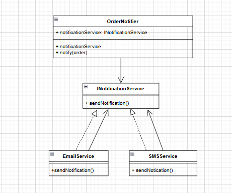

# Dependency Inversion Principle (DIP)
## Scenario
The class OrderNotifier in ShopEase directly creates an instance of EmailService to send notifications. Later, you want to introduce SMSService for notifications as well.
## Understand the Problem
Directly depending on `EmailService` in the `OrderNotifier` class violates the Dependency Inversion Principle because it creates a tight coupling between `OrderNotifier` and a specific implementation of notification. This makes it difficult to introduce new notification methods (like SMS) without modifying `OrderNotifier`.

## Design an Abstraction

## Injection Strategy
To inject the concrete `INotificationService` into `OrderNotifier`, I would use constructor injection. The `OrderNotifier` constructor would accept an `INotificationService` parameter, allowing it to work with any implementation of the interface.

## Justification
This approach adheres to the Dependency Inversion Principle by depending on abstractions rather than concrete implementations. It enhances flexibility, as new notification methods can be added without modifying existing code. Additionally, it improves testability, as mock implementations of `INotificationService` can be easily created for unit testing, allowing for isolated testing of the `OrderNotifier` class.
