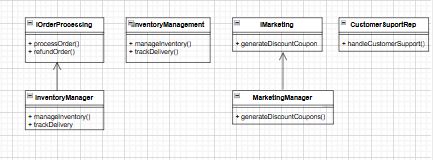

# Interface Segregation Principle (ISP)
## Scenario
A single interface IMerchantServices currently includes the following methods:

processOrder()
refundOrder()
generateDiscountCoupons()
trackDelivery()
manageInventory()
handleCustomerSupport()
However, some classes only need a subset of these methods.
## Identify Unnecessary Methods
- **InventoryManager**: Needs `manageInventory()`, `trackDelivery()`.
- **CustomerSupportRep**: Needs `handleCustomerSupport()`.
- **MarketingManager**: Needs `generateDiscountCoupons()`.

## Propose Segmented Interfaces

## Brief Write-Up
Segmenting the large `IMerchantServices` interface into smaller, more specific interfaces allows each class to implement only the methods it requires. This reduces the complexity of the classes and makes them easier to maintain. By adhering to the Interface Segregation Principle, we ensure that classes are not forced to depend on methods they do not use, leading to a cleaner and more efficient design.
