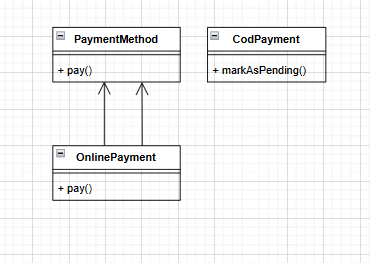

# Liskov Substitution Principle (LSP)
## Scenario
In ShopEase, there is a PaymentMethod base class with a method pay(). Subclasses like CreditCardPayment and PayPalPayment are expected to implement pay() properly.

However, a new subclass CodPayment (Cash-on-Delivery) attempts to override pay() but has a different workflow: it doesn’t actually process online transactions. It simply marks the order as "Pending Payment" to be collected later.
## Analyze the Violation
The `CodPayment` class violates the Liskov Substitution Principle if it overrides the `pay()` method in a way that deviates from the expected behavior of processing an immediate payment. If other parts of the system expect `pay()` to complete a transaction, substituting `CodPayment` could lead to unexpected behavior, such as orders being marked as paid when they are not.

## Propose a Better Design

## Reasoning
In the revised design, `CodPayment` does not inherit from `PaymentMethod`. Instead, it could implement a different interface, such as `PendingPayment`, which has a method like `markAsPending()`. This preserves the ability to substitute subclasses without breaking the system's logic, as each payment method adheres to its own expected behavior without conflicting with others.
