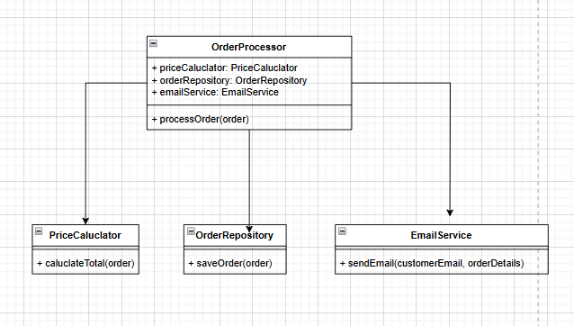

# Single Responsibility Principle (SRP):
## Scenario
ShopEase has a single class named OrderProcessor that does the following:

      1. Calculates the total price of an order (including discounts and taxes).
      2. Saves the order details to the database.
      3. Sends an order confirmation email to the customer.

## Identify Responsibilities
- **Calculate Total Price**: Computes the total cost of an order, factoring in discounts and taxes.
- **Save Order Details**: Handles the persistence of order information to a database.
- **Send Confirmation Email**: Manages the process of sending an order confirmation email to the customer.

## Problem with Multiple Responsibilities
Having multiple responsibilities in one class can lead to a tightly coupled design, making it difficult to maintain and modify. Changes in one responsibility (e.g., how emails are sent) could inadvertently affect others (e.g., order calculations), leading to bugs and increased complexity. This violates the principle of separation of concerns, making the code harder to understand and test.

## Proposed Refactor

## Justification
The refactored design adheres to the Single Responsibility Principle by separating the concerns of price calculation, order persistence, and email notification into distinct classes. This modular approach enhances maintainability, as each class can be modified or tested independently without affecting the others. It also promotes code reuse and clarity, making it easier for developers to understand the system's architecture.
